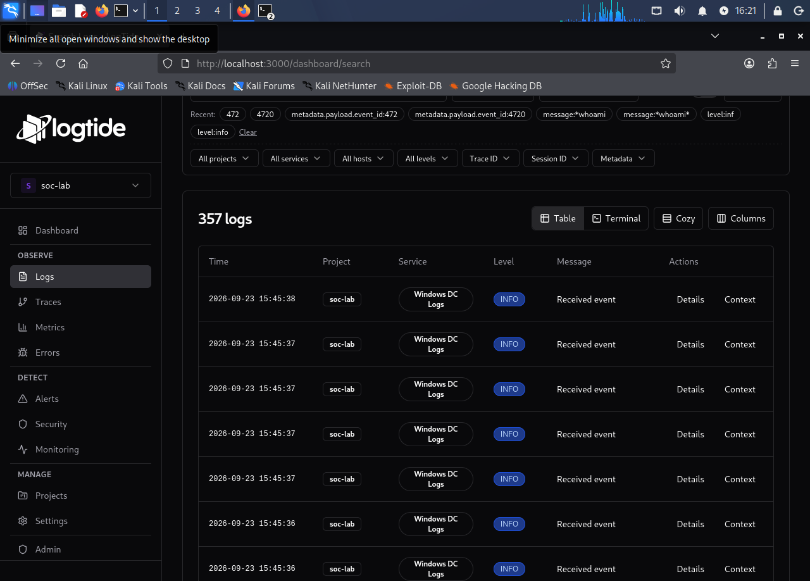
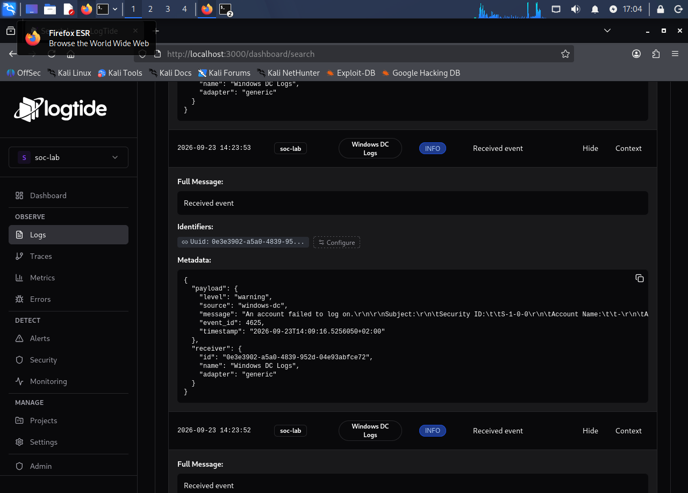
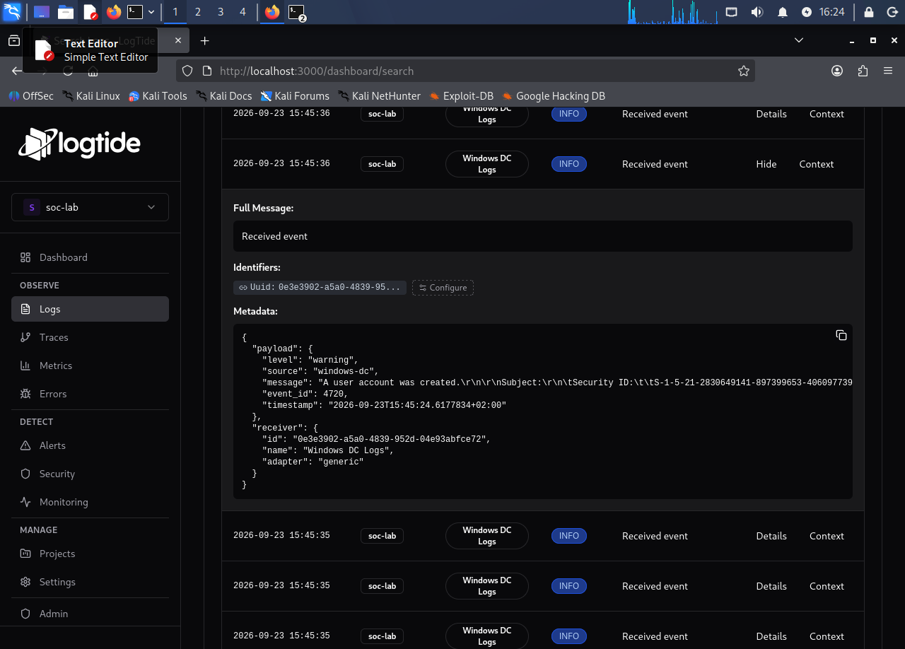
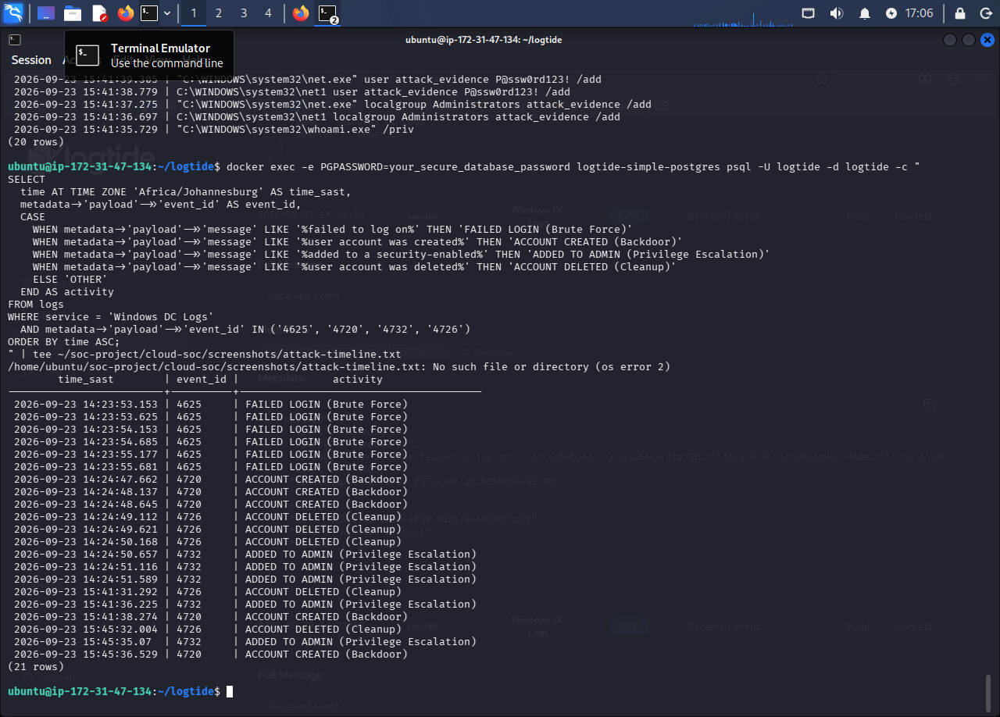
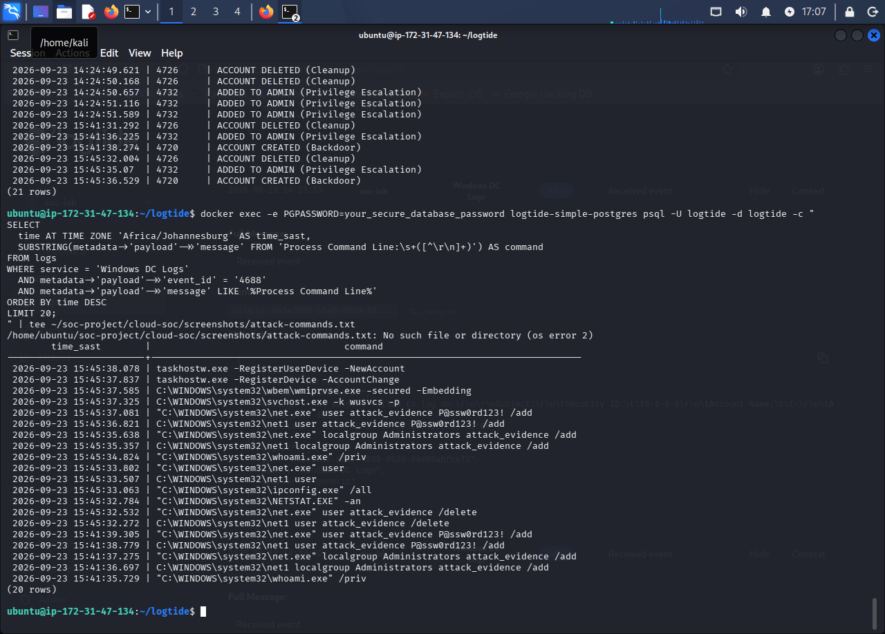
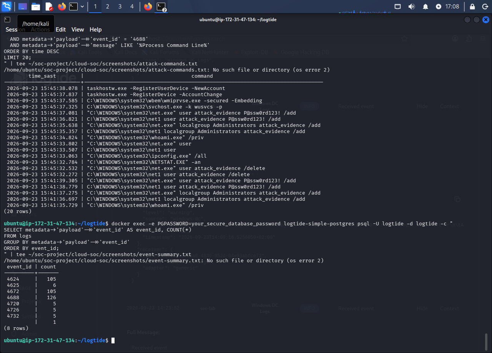

# Cloud SOC — Screenshots

## LogTide Dashboard

*350+ logs ingested from Windows DC*

## Attack Detection

### Brute Force — Event 4625

*6 failed login attempts in 2.5 seconds*

### Backdoor Account Creation — Event 4720

*Multiple backdoor accounts created*

### Attack Timeline

*Complete chronological sequence of the attack*

### Process Execution Commands — Event 4688

*Exact commands executed by the attacker*

### Event Summary

*Breakdown of events by Event ID*
